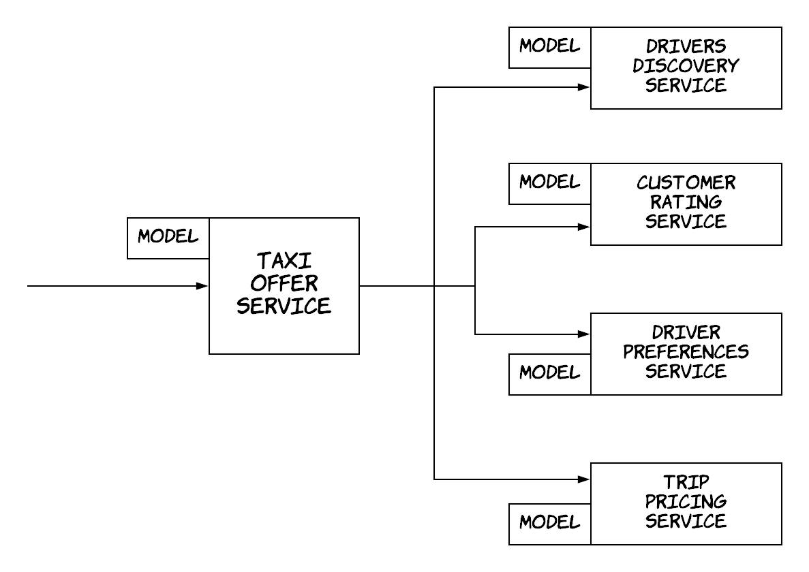

## Project purpose
The purpose of this project is to demonstrate how one 
can create a suite of acceptance tests in a microservice environment that:
* are lightweight
* can evolve with minimal code changes as more components are added to the service under test
* are not dependent on prior setups from the dependent services

The main idea and the motivation behind it can be found [in this blog post](https://dimosr.github.io/acceptance-tests-with-spring/).

## Problem and architecture

For the purpose of demonstration, the project contains a slightly contrived solution 
to the problem of building an online taxi service.

The overall environment consists of 4 services:
* the **taxi offer service**, which is the main service that's 
responsible for retrieving the trip details and the customer data 
and returning offers.
* the **drivers discovery service**, which is a dependent service that's
responsible for returning all the drivers available near a location.
* the **driver preferences service**, which is a dependent service that's
responsible for returning the preferences of the provided drivers with regards
to prices and customer ratings.
* the **customer rating service**, which is a dependent service that's
responsible for returning the rating of the provided customer.
* the **trip pricing service**, which is a dependent service that's
responsible for calculating the price of a trip between 2 locations.



In this case, the SUT (system-under-test) is the *taxi offer service* and
the rest are services the SUT depends on.

## Project structure

The project is structured as a multi-project gradle project.
You can see that each service consists of 2 gradle sub-projects:
* one project for the code of the service itself, i.e. *customer-rating-service*
* another project that contains the code of the model classes that are used for communicating with this service, i.e. *customer-rating-service-model*

In practice, each one of these projects could reside in separate repos. 
Here, they all reside in a single repo for the convenience of the demo.

The services are developed using Spring Boot and Jackson as the serialisation protocol for inter-service communication with requests being exchanged over HTTP.

## Running the services
Following the instructions below, you can run all the services and execute some requests:
* Start the *drivers discovery service* (port 8090)
```
./gradlew :drivers-discovery-service:bootRun
```
* Start the *customer rating service* (port 8091)
```
./gradlew :customer-rating-service:bootRun
```
* Start the *trip pricing service* (port 8092)
```
./gradlew :trip-pricing-service:bootRun
```
* Start the *driver preferences service* (port 8093)
```
./gradlew :driver-preference-service:bootRun
```
* Start the *taxi offer service* (port 8080)
```
./gradlew :taxi-offer-service:bootRun
```
* Now that all service are running, you can send a request to the taxi offer service,
by executing a POST request at `http://localhost:8080/taxi-offers` with a body of the following type:
```json
{
	"trip": {
		"start": {
			"latitude": 34.43,
			"longitude": 52.12
		},
		"end": {
			"latitude": 31.53,
			"longitude": 50.72
		}
	},
	"customerId": "2175a8ce-ebac-4b4e-ba2b-53ae4e28b589"
}
```

## Running the tests
You can also run the acceptance tests executing the following command:
```
./gradlew :taxi-offer-service:test
```
These tests are creating stub instances of the dependent services and 
setting up stub responses using the data available under `taxi-offer-service/src/test/resources/dependencies/`.
Then, they are reading the directories under `taxi-offer-service/src/test/resources/requests/`
and they using the data there to run requests against the SUT and verify against the expected responses.

The main code for the acceptance tests framework is in the packages under `taxi-offer-service/src/test/java/taxi/offer`
